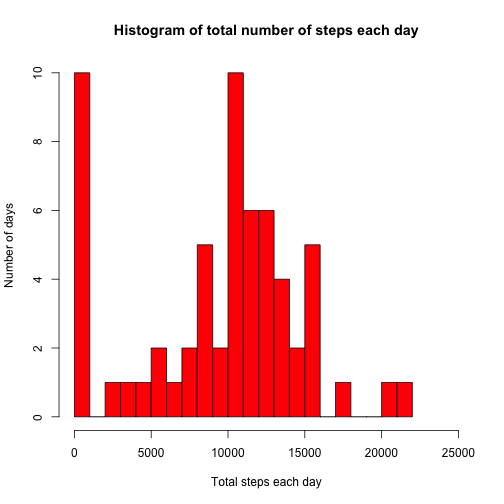
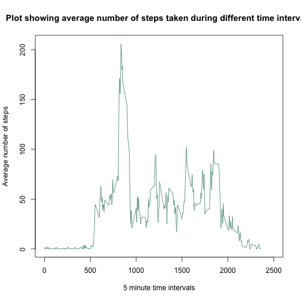
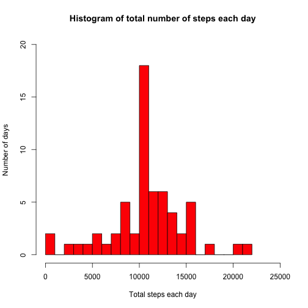
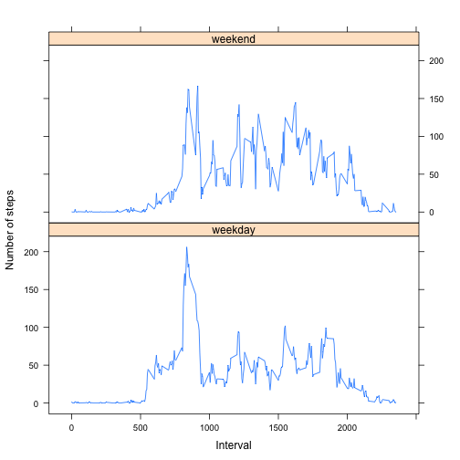

# Reproducible Research: Peer Assessment 1
==========================================

The dataset for the assignment contains data from a personal activity monitoring device.
## Loading and preprocessing the data


```r
unzip("activity.zip")
data <- read.csv("activity.csv")
data[,2] <- as.Date(data[,2])   ## convert date column from char to date type
```

## What is mean total number of steps taken per day?

This part of the analysis shows a histogram of the total number of steps taken each day.


```r
steps_day <- NULL
temp <- split(data, data$date)  ## split data according to date

for(i in seq_along(temp)) {
    steps_day[i] <- sum(temp[[i]]$steps, na.rm = TRUE)
}   ## loop to calulate total steps each day

hist(steps_day, xlab="Total steps each day", ylab = "Number of days", main = "Histogram of total number of steps each day", col = "red", breaks = 25, xlim = c(0, 25000))
```

 

Now we calculate the mean and median of total number of steps taken per day.


```r
sprintf("Mean of steps taken per day: %.2f", mean(steps_day))    ## NAs already removed while calculating total steps per day
```

```
## [1] "Mean of steps taken per day: 9354.23"
```

```r
sprintf("Median of steps taken per day: %d", median(steps_day))
```

```
## [1] "Median of steps taken per day: 10395"
```

## What is the average daily activity pattern?

To find a average daily activity pattern, we plot a time series plot of time intervals (x axis) and number of steps (averaged across all days) taken during that interval (y axis).


```r
time_interval <- split(data, data$interval) ## split data by time interval
interval_avg <- NULL

for(i in seq_along(time_interval)) {
    interval_avg[i] <- mean(time_interval[[i]]$steps, na.rm = TRUE)
}   ## find the average steps in each time interval for all the days in dataset, remove NAs

time_interval <- data.frame(interval = unique(data$interval), avg.step = interval_avg)  ## create new dataframe by retaining the interval column and adding the average column

with(time_interval, plot(time_interval$interval, time_interval$avg.step, type = "l", col = "aquamarine4", xlab = "5 minute time intervals", ylab = "Average number of steps", main = "Plot showing average number of steps taken during different time intervals", xlim = c(0, 2500)))
```

 

We also state the 5 minute interval containing the maximum number of steps (averaged across all days).


```r
max_avg <- time_interval$interval[which.max(time_interval$avg.step)]    ## we find the index of the maximum value and then print the max value
sprintf("%d th minute time interval has the maximum number of average steps across all days.", max_avg)
```

```
## [1] "835 th minute time interval has the maximum number of average steps across all days."
```

```r
sprintf("Number of steps that %d th minute interval has: %.4f", max_avg, time_interval$avg.step[which.max(time_interval$avg.step)])
```

```
## [1] "Number of steps that 835 th minute interval has: 206.1698"
```

## Inputing missing values

First we report the total number of missing values.


```r
sum(is.na(data$steps))  ## total number of NAs, since only the steps column has missing values
```

```
## [1] 2304
```


We replace the NAs using the mean for that 5 minute interval (across all days) and create a new dataset with NA values filled in.


```r
data <- split(data, data$interval)  ## split data using intervals

for(i in seq_along(data)) {
    meanvar <- mean(data[[i]]$steps, na.rm = TRUE)  ## store the mean of the interval, NAs removed
    index <- which(is.na(data[[i]]$steps), arr.ind = TRUE)  ## store array index of missing values
    data[[i]]$steps[index] <- meanvar   ## replace NAs with the mean of the interval to which they belong
}

data <- do.call(rbind.data.frame, data) ## convert the split list back to data frame
data <- data[order(data[,"date"]),] ## sort data according to dates
```

We create a histogram again, of total number of steps taken each day. We also recalculate the mean and the median for total number of steps taken each day.


```r
## we just use the code from above
steps_day <- NULL
temp <- split(data, data$date)  ## split data according to date

for(i in seq_along(temp)) {
    steps_day[i] <- sum(temp[[i]]$steps, na.rm = TRUE)
}   ## loop to calulate total steps each day

hist(steps_day, xlab="Total steps each day", ylab = "Number of days", main = "Histogram of total number of steps each day", col = "red", breaks = 25, xlim = c(0, 25000), ylim = c(0, 20))
```

 


```r
## code from above
sprintf("Mean of steps taken per day (NAs filled in): %.3f", mean(steps_day))    
```

```
## [1] "Mean of steps taken per day (NAs filled in): 10766.189"
```

```r
sprintf("Median of steps taken per day (NAs filled in): %.2f", median(steps_day))
```

```
## [1] "Median of steps taken per day (NAs filled in): 10766.19"
```

Since a lot of days contained only NAs, when we took the sum of steps for the each the sum came out to be 0 in such cases. Now that we fill in these NA values with the average of the time intervals, all the days having total steps as 0 initially, are assigned the same number of steps. Now when we take the mean and the median of this data or plot the histogram, these differ from the original case.

## Are there differences in activity patterns between weekdays and weekends?

We finally compare the average number of steps for each interval for the weekdays and the weekends. We plot the 5-minute intervals on the x axis and the the number of steps on the y axis. We use the weekdays() function to factor the dataset into 2 parts ie weedays and weekends. 


```r
data["day"] <- weekdays(data$date, abbreviate = FALSE)  ## add day column
holiday <- c("Saturday", "Sunday")

avg <- NULL     ## creae an empty var
weekend <- data[data$day %in% holiday,] ## separate out rows having days in weekend
weekend <- split(weekend, weekend$interval) ## split according to interval_avg
for(i in seq_along(weekend)) {
    avg[i] <- mean(weekend[[i]]$steps, na.rm = TRUE)
}   ## calculate avg steps for each interval
weekend <- data.frame(interval = unique(data$interval), avg = avg)  ## new data frame with interval and steps as column
weekend["day.type"] <- c(rep("weekend", length(weekend$interval)))  ## new column added, filled with value of weekend

weekday <- data[!(data$day %in% weekend),]  ## separate out rows having days in weekdays
weekday <- split(weekday, weekday$interval) ## split according to interval_avg
for(i in seq_along(weekday)) {
    avg[i] <- mean(weekday[[i]]$steps, na.rm = TRUE)
}   ## calculate avg steps for each interval
weekday <- data.frame(interval = unique(data$interval), avg = avg)  ## new data frame with interval and steps as column
weekday["day.type"] <- c(rep("weekday", length(weekday$interval)))  ## new column added, filled with value of weekend
data <- rbind(weekend, weekday) ## bind the 2 tables together, the day.type column identifies the weekday and weekend data

library(lattice)
xyplot(avg ~ interval | day.type, data = data, layout = c(1, 2), type = "l", xlab = "Interval", ylab = "Number of steps")   ## plot using lattice type, separate on weekdays and weekends
```

 

